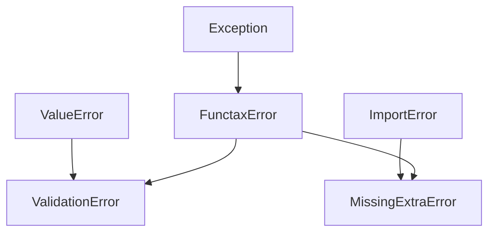

# Exceptions

Every error raised by the package derives from [`FunctaxError`][functax.FunctaxError] *and* from the closest standard-library exception.

```mermaid
graph TD
    E[Exception] --> F[FunctaxError]
    V[ValueError] --> VE[ValidationError]
    F --> VE
    I[ImportError] --> ME[MissingExtraError]
    F --> ME
```

::: functax.exceptions
